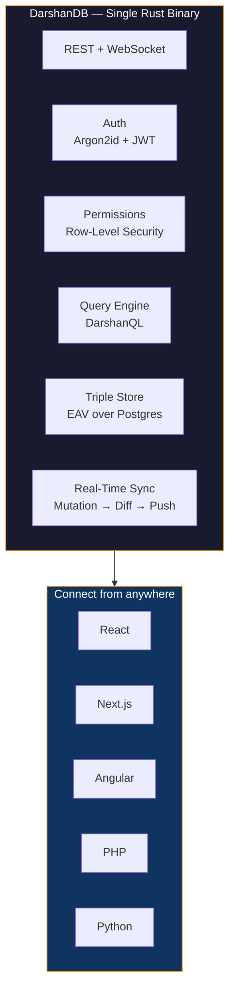

---

> *"Sreyaan sva-dharmo vigunah para-dharmaat su-anushthitaat"*
> Better to walk your own path imperfectly than another's path perfectly. — Bhagavad Gita 3.35

I grew up in Navsari, a small town in southern Gujarat where Parsi fire temples stand next to Hindu mandirs and the chai tastes like monsoon rain. My father would say *"darshan karo"* every morning — see clearly. That word followed me across three countries and became the name of what I'm building now.

London for studies — Business Computing at Greenwich, Advanced Diploma at Sunderland. Dubai for production — VFX pipelines for Aquaman, The Invisible Man, The Last of Us Part II. Back to India, Ahmedabad, to build companies: GraymatterOnline (2015), Graymatter International (2018), Coeus Digital Media (2020), KnowAI (2024).

Four companies across a decade. Every one hit the same wall: the backend. Three weeks of plumbing before writing a single line of business logic. So I built the tool I always needed.

---

## DarshanDB

A self-hosted Backend-as-a-Service built in Rust. Triple-store architecture over PostgreSQL. One binary that gives you a database, real-time sync, authentication, row-level permissions, and an admin dashboard. SDKs for React, Angular, Next.js, PHP, and Python.

**446 Rust tests. 92 TypeScript. 141 Python. 52 PHP. Auth, permissions, queries, and real-time — working end-to-end.**

**[github.com/darshjme/darshandb](https://github.com/darshjme/darshandb)**

---

## Companies

| Company | Role | Since |
|---------|------|-------|
| **[KnowAI](https://knowai.biz)** | Co-Founder & CTO | 2024 |
| **Coeus Digital Media LLC** | Founder & CTO | 2020 |
| **Graymatter International Inc** | Founder & MD | 2018 |
| **[GraymatterOnline LLP](https://graymatteronline.com)** | Founder & CEO | 2015 |

---

## Stack

  
  
  
  
  
  
  
  
  
  

---

## Credentials

**Ph.D.** Business Computing Science | **CCNA** | **MCSE** | **CEH**

University of Greenwich | University of Sunderland

**VFX production:** Aquaman | The Invisible Man | The Last of Us Part II

---

  

---

Navsari | London | Dubai | Ahmedabad

