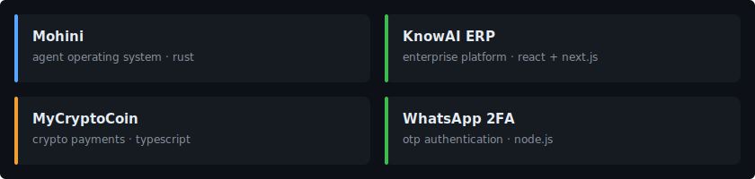
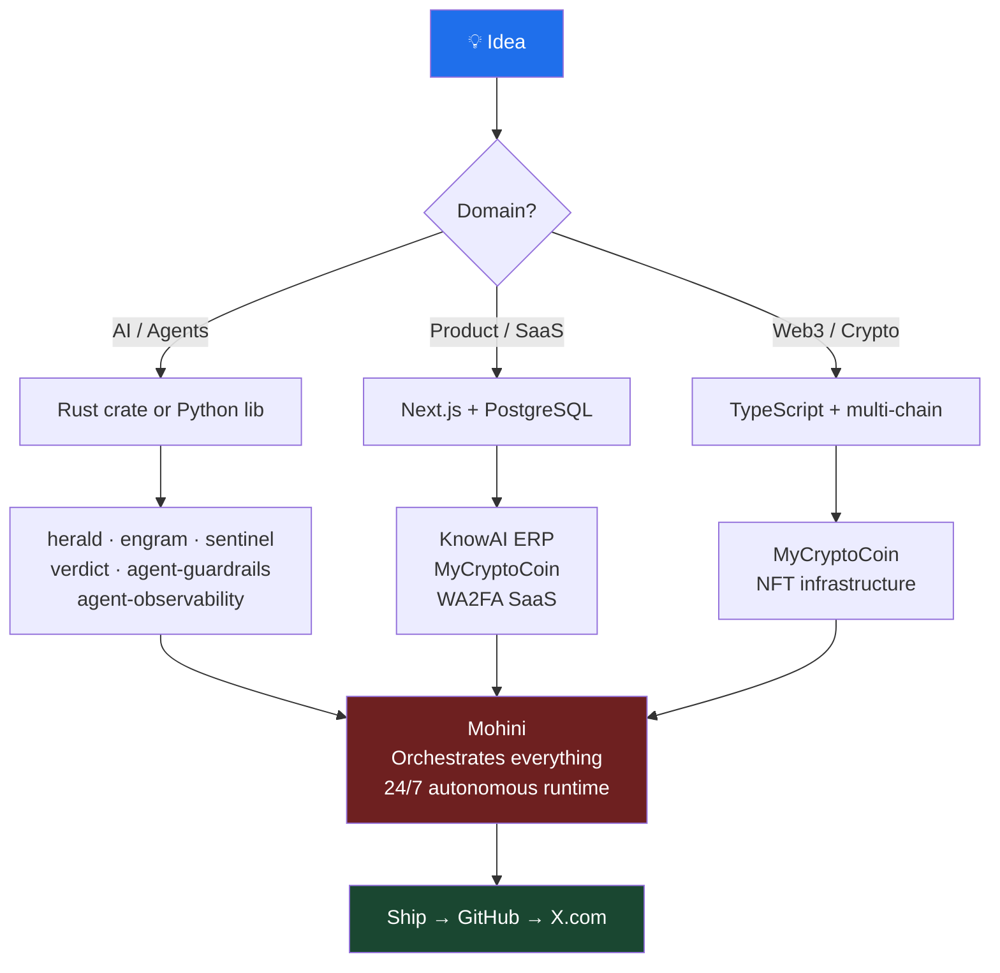

---

I build autonomous systems in Rust and ship products across AI, crypto, and enterprise. Founded my first company in 2015. Currently running three — Coeus Digital Media, Graymatter International, and KnowAI.

Before all this, I did VFX for Aquaman, The Invisible Man, and The Last of Us Part II. Made India's first NFT-funded film. Studied at Greenwich and Sunderland. Hold a CCNA, MCSE, and CEH.

Most of my time now goes into **Mohini** — an agent OS written from scratch in Rust. 14 crates, 104 skills, 40 channels, 188 models. One binary.

---

## Production Agent Infrastructure

 

The complete production agent pipeline — 28 zero-dependency Python libraries: [arsenal →](https://github.com/darshjme/arsenal)

| Library | Description |
|---|---|
| [**agent-evals**](https://github.com/darshjme/agent-evals) | Evaluation framework for LLM agent outputs and behaviors |
| [**react-guard-patterns**](https://github.com/darshjme/react-guard-patterns) | ReAct loop guard patterns to prevent runaway agent execution |
| [**llm-router**](https://github.com/darshjme/llm-router) | Intelligent routing across LLM providers based on cost and capability |
| [**agent-memory**](https://github.com/darshjme/agent-memory) | Persistent and working memory primitives for stateful agents |
| [**agent-guardrails**](https://github.com/darshjme/agent-guardrails) | Input/output safety guardrails for production agent pipelines |
| [**agent-observability**](https://github.com/darshjme/agent-observability) | Structured tracing, logging, and metrics for agent systems |
| [**agent-budget**](https://github.com/darshjme/agent-budget) | Token and cost budgeting with hard limits and alerts |
| [**agent-context**](https://github.com/darshjme/agent-context) | Context window management and intelligent compression |
| [**agent-tools**](https://github.com/darshjme/agent-tools) | Tool registry, validation, and execution harness |
| [**agent-retry**](https://github.com/darshjme/agent-retry) | Retry logic with exponential backoff and circuit breakers |
| [**agent-state**](https://github.com/darshjme/agent-state) | Lightweight agent state machine with transition guards |
| [**agent-schema**](https://github.com/darshjme/agent-schema) | Schema validation for structured LLM outputs |
| [**agent-pipeline**](https://github.com/darshjme/agent-pipeline) | Composable pipeline orchestrator: Route→Budget→Guard→Remember→Compress→Observe→Evaluate→Validate→Retry→State→Schema |
| [**agent-cache**](https://github.com/darshjme/agent-cache) | Semantic and exact caching for LLM calls — cut costs by catching duplicate and similar prompts |
| [**agent-config**](https://github.com/darshjme/agent-config) | Secrets, env config, hot-reload — zero credential leaks with auto-redacting SecretStr |
| [**agent-events**](https://github.com/darshjme/agent-events) | Event bus, pub/sub, and history replay for multi-agent coordination |
| [**agent-health**](https://github.com/darshjme/agent-health) | Health checks and liveness monitoring — HTTP, disk, memory, latency probes in parallel |
| [**agent-rate-limiter**](https://github.com/darshjme/agent-rate-limiter) | Proactive rate limiting for LLM API calls — prevent 429 errors before they happen |
| [**agent-circuit-breaker**](https://github.com/darshjme/agent-circuit-breaker) | Circuit breaker pattern — CLOSED/OPEN/HALF_OPEN state machine, FallbackBreaker for cascade failure prevention |
| [**agent-validator**](https://github.com/darshjme/agent-validator) | Input validation, prompt injection detection, PII scanning — composable rule chains, zero dependencies |
| [**agent-logger**](https://github.com/darshjme/agent-logger) | Structured JSON logging, correlation IDs, auto-redaction, log sampling — trace every request end-to-end |
| [**agent-timer**](https://github.com/darshjme/agent-timer) | SLA enforcement, p50/p95/p99 tracking, @timed decorator, multi-step profiler — zero dependencies |
| [**agent-queue**](https://github.com/darshjme/agent-queue) | Priority task queue, deduplication, worker pool, backpressure — zero dependencies |
| [**agent-fallback**](https://github.com/darshjme/agent-fallback) | FallbackChain, ConditionalFallback, RetryThenFallback, @fallback decorator — zero dependencies |
| [**agent-semaphore**](https://github.com/darshjme/agent-semaphore) | Concurrency limiting, resource pool, throttled executor, @limit_concurrent — zero dependencies |
| [**agent-dependency**](https://github.com/darshjme/agent-dependency) | DI container, @inject decorator, scoped containers, ServiceLocator — zero dependencies |
| [**agent-context-window**](https://github.com/darshjme/agent-context-window) | Token counting, sliding window, content prioritization, truncation strategies — zero dependencies |

---

  

**[Mohini](https://github.com/darshjme/mohini)** — Full agentic runtime. Persistent memory, WASM-sandboxed skills, shadow spawning, self-healing orchestration. The whole stack in Rust.

**[KnowAI ERP](https://github.com/darshjme/knowai-erp)** — AI-native enterprise platform. React 19, Next.js 15, PostgreSQL. Built for real operations, not demos.

**[MyCryptoCoin](https://github.com/darshjme/mycryptocoin)** — Multi-chain crypto payment gateway. One API, every chain. TypeScript.

**[WhatsApp 2FA](https://github.com/darshjme/whatsapp-2fa)** — Self-hosted OTP/2FA over WhatsApp. REST API, zero third-party dependency.

---

## How I Build

---

| Company | Role | Since |
|---|---|---|
| **KnowAI** | Co-Founder, CFO & CTO | 2024 |
| **Coeus Digital Media LLC** | Founder & CTO | 2020 |
| **Graymatter International Inc** | Founder & MD | 2018 |
| **GraymatterOnline LLP** | Founder & CEO | 2015 |

---

  
  
  
  
  
  
  
  
  

Ph.D. Business CS · Hons Business Computing (Greenwich) · Advanced Diploma IT (Sunderland) · CCNA · MCSE · CEH

---

  
  
  
  

---

  
  

  

---

India · Dubai · USA

