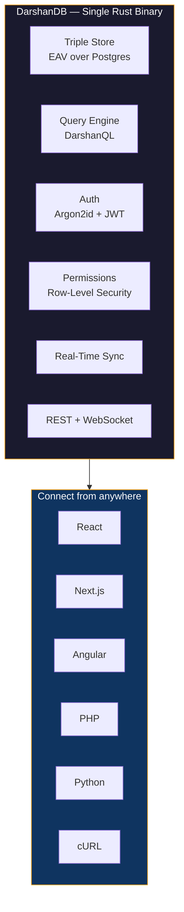

---

> *"Sreyaan sva-dharmo vigunah para-dharmaat su-anushthitaat"*
> Better to walk your own path imperfectly than another's path perfectly. — Bhagavad Gita 3.35

Born in Navsari, Gujarat. Studied in London. Built production systems in Dubai. Now in Ahmedabad, building what I always wanted to exist.

My grandfather would say *"darshan karo"* every morning. See clearly. That word followed me across continents and became the name of what I'm building now.

---

## DarshanDB

A self-hosted Backend-as-a-Service built in Rust. Triple-store architecture over PostgreSQL. One binary that gives you a database, real-time sync, authentication, permissions, file storage, and an admin dashboard.

**446 Rust tests passing. Auth, permissions, and data path working end-to-end.**

**[github.com/darshjme/darshandb](https://github.com/darshjme/darshandb)**

---

| Company | Role | Since |
|---|---|---|
| **[KnowAI](https://knowai.biz)** | Co-Founder & CTO | 2024 |
| **Coeus Digital Media LLC** | Founder & CTO | 2020 |
| **Graymatter International Inc** | Founder & MD | 2018 |
| **[GraymatterOnline LLP](https://graymatteronline.com)** | Founder & CEO | 2015 |

---

  
  
  
  
  

Ph.D. Business CS | Greenwich | Sunderland | CCNA | MCSE | CEH

VFX: Aquaman, The Invisible Man, The Last of Us Part II

---

  

---

Navsari | London | Dubai | Ahmedabad

