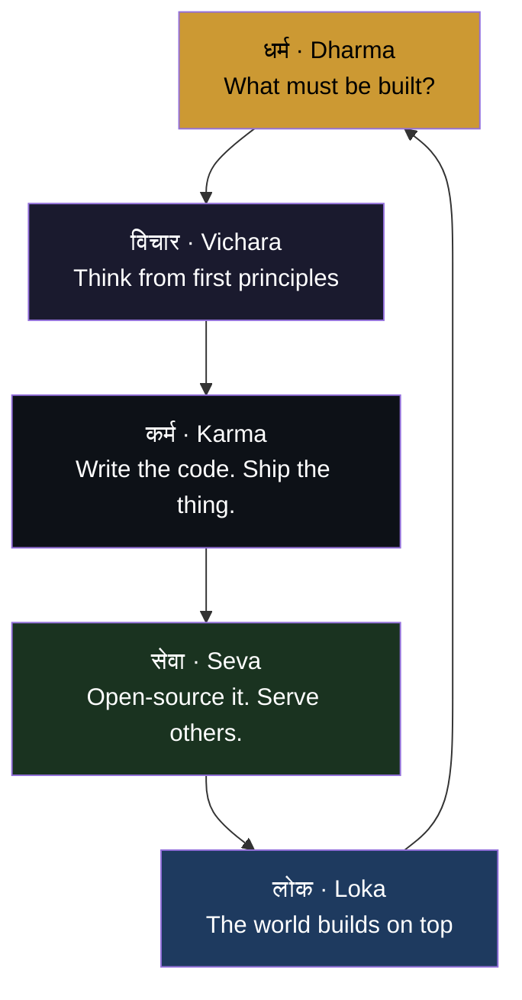

---

> *"Śreyān sva-dharmo viguṇaḥ para-dharmāt su-anuṣṭhitāt"*
> Better to walk your own path imperfectly than another's path perfectly. — Bhagavad Gita 3.35

I am a Brahmin from Gujarat. My ancestors built temples. I build systems.

The Sompura Brahmins of my land carved stone into structures that outlasted empires. The tools changed — chisel became compiler, sandstone became silicon — but the intent is the same: **build something permanent. Build something that serves.**

Vyasa compiled the Vedas so knowledge wouldn't scatter. I write open-source so tools don't stay locked. Same dharma. Different medium.

Founded my first company in 2015. Currently running three across AI, media, and enterprise — Coeus Digital Media, Graymatter International, and KnowAI. Before this: VFX for Aquaman, The Invisible Man, The Last of Us Part II. India's first NFT-funded film. Ph.D. Business CS. CCNA. MCSE. CEH.

Most of my time now goes into **Mohini** — an autonomous agent OS I'm writing from scratch. Named after the enchantress form of Vishnu. She routes, remembers, guards, evaluates. 14 crates in Rust. She never sleeps.

---

## The Arsenal — Six Ways Agents Fail in Production

<<<<<<< HEAD
Six libraries. Zero external dependencies. Built from first principles.
=======
 
>>>>>>> cdc8e6c (docs: 55 libs, 2432 tests)

| Library | What it solves | Tests |
|---------|---------------|-------|
| [herald](https://github.com/darshjme/herald) | Semantic routing — dispatch to specialists, not generalists | ✓ |
| [engram](https://github.com/darshjme/engram) | Memory — short-term context + episodic recall | ✓ |
| [sentinel](https://github.com/darshjme/sentinel) | Guards — stop runaway ReAct loops before they cost you | ✓ |
| [verdict](https://github.com/darshjme/verdict) | Evaluation — 3D scoring: task / reasoning / tool use | ✓ |
| [agent-guardrails](https://github.com/darshjme/agent-guardrails) | Validation — schema, content safety, retry logic | ✓ |
| [agent-observability](https://github.com/darshjme/agent-observability) | Tracing — latency, tokens, span lifecycle | ✓ |

→ [arsenal](https://github.com/darshjme/arsenal) — the full pipeline

---

## How I Build

---

## Other Projects

**[KnowAI ERP](https://github.com/darshjme/knowai-erp)** — AI-native enterprise platform. React 19, Next.js 15, PostgreSQL.

**[MyCryptoCoin](https://github.com/darshjme/mycryptocoin)** — Multi-chain crypto payment gateway. One API, every chain.

**[WA2FA SaaS](https://github.com/darshjme/wa2fa-saas)** — Self-hosted OTP/2FA over WhatsApp. Zero third-party dependency.

---

| Company | Role | Since |
|---|---|---|
| **KnowAI** | Co-Founder, CFO & CTO | 2024 |
| **Coeus Digital Media LLC** | Founder & CTO | 2020 |
| **Graymatter International Inc** | Founder & MD | 2018 |
| **GraymatterOnline LLP** | Founder & CEO | 2015 |

---

  
  
  
  
  
  
  
  

Ph.D. Business CS · Hons Business Computing (Greenwich) · Advanced Diploma IT (Sunderland) · CCNA · MCSE · CEH

---

  
  
  
  

---

  
  

  

---

गुजरात · India · Dubai · USA

